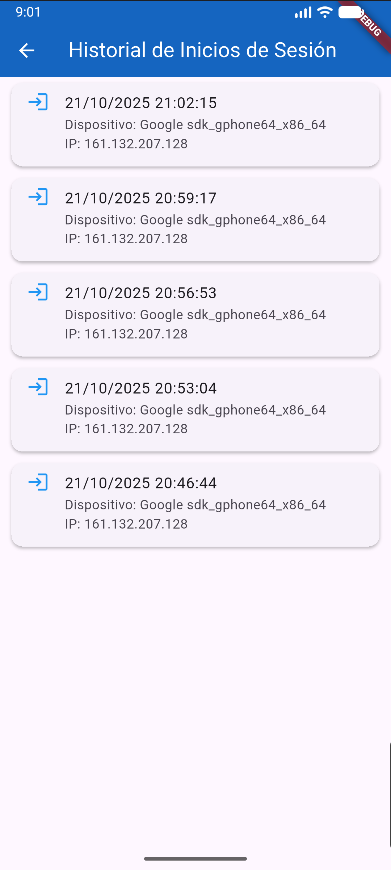

# Examen Práctico - Proyecto MovUni

## Curso
**Soluciones Móviles II**

## Alumno
**Jesús Eduardo Agreda Ramirez**

## Fecha
**21 de octubre de 2025**

## Repositorio en GitHub
[https://github.com/mangoesafterplay/SM2_EXAMEN_PRACTICO.git](https://github.com/mangoesafterplay/SM2_EXAMEN_PRACTICO.git)

---

## Descripción del Proyecto

**MovUni** es una aplicación móvil desarrollada con fines académicos para la **Universidad Privada de Tacna**, inspirada en plataformas de transporte colaborativo como *InDrive*, pero pensada exclusivamente para estudiantes universitarios.  
El objetivo del proyecto es facilitar la movilidad entre estudiantes mediante una aplicación que conecta a conductores y pasajeros dentro de la comunidad universitaria, promoviendo la seguridad, confianza y accesibilidad en los traslados.

---

## Historia de Usuario

**Como usuario autenticado,**  
quiero ver un historial de mis inicios de sesión,  
para saber cuándo y desde qué dispositivo accedí a mi cuenta.

### Criterios de Aceptación
- Al iniciar sesión exitosamente, se registra el usuario, la fecha y hora del inicio, así como la dirección IP desde donde inició sesión.  
- En la sección **"Historial de inicios de sesión"**, el usuario puede ver una lista con:
  - Nombre de usuario  
  - Fecha y hora de inicio de sesión  
- Los registros deben mostrarse ordenados del más reciente al más antiguo.

---

## Funcionalidades Implementadas

> - Registro y autenticación de usuarios  
> - Visualización del historial de inicios de sesión  
> - Almacenamiento de registros en base de datos local o remota  
> - Interfaz de usuario con diseño limpio y adaptable  

---

## Evidencia de las Funcionalidades

_A continuación se presentarán capturas de pantalla de la aplicación mostrando las principales funcionalidades implementadas._

### Captura 1: Pantalla de inicio de sesión

### Captura 2: Panel lateral para ver el historial de inicios de sesión

### Captura 3: Vista del historial de inicios de sesión

---

## Tecnologías Utilizadas

- **Framework principal:** Flutter  
- **Lenguaje de programación:** Dart  
- **Base de datos:** Firebase / LocalStorage
- **Gestión de dependencias:** pubspec.yaml  
- **Control de versiones:** Git + GitHub  

---

## Autor
Desarrollado por **Jesús Eduardo Agreda Ramirez**  
Estudiante de Ingeniería de Sistemas – **Universidad Privada de Tacna**

